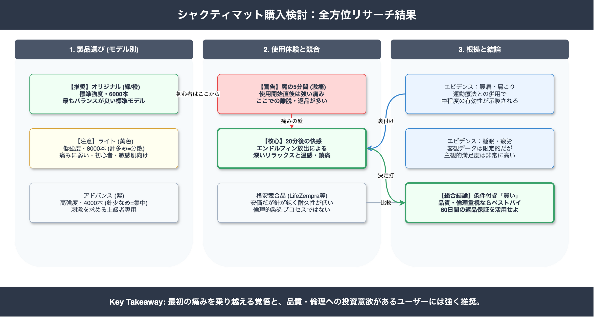
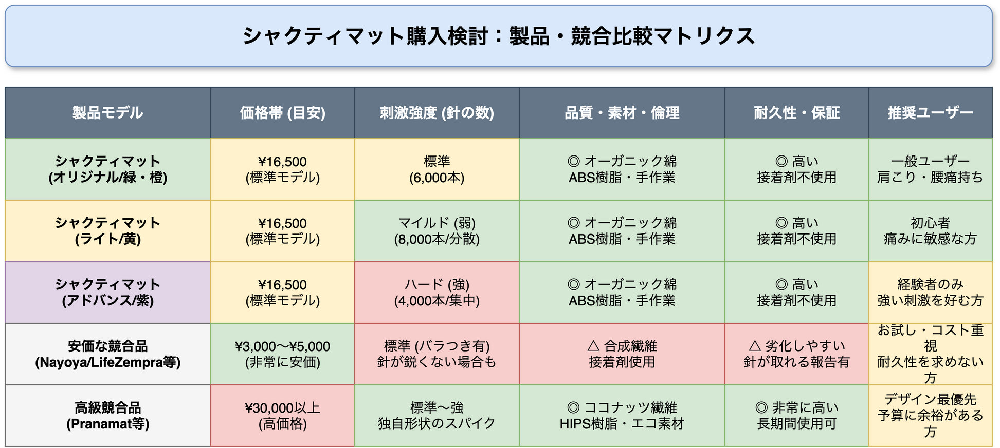
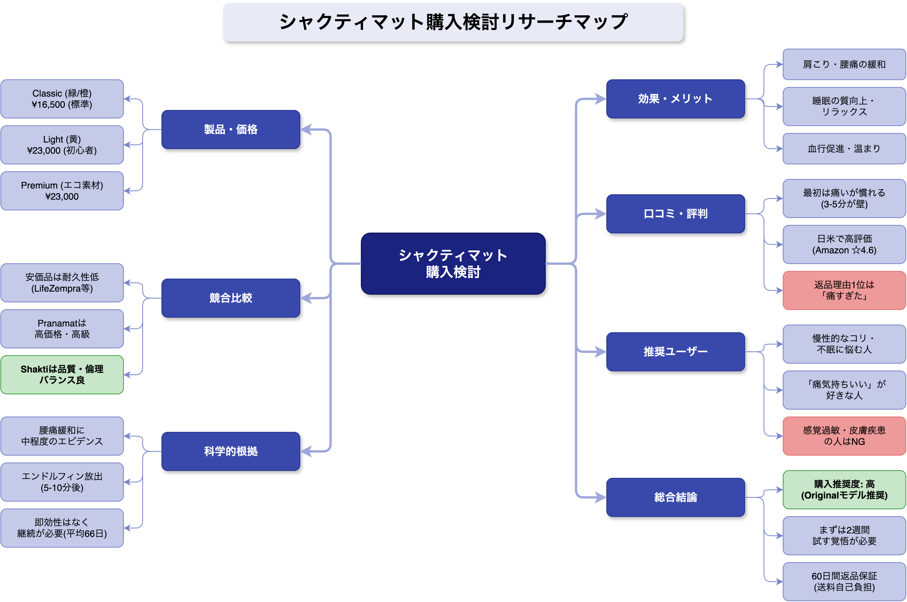

<!-- _class: title -->

# シャクティマット購入検討
## 製品・口コミ・競合・科学的根拠に基づく総合評価

2026-03-17 | AI Research Agent

---
<!-- _class: light -->

## エグゼクティブサマリー

**総合評価: 購入推奨「高」** High
品質・倫理的製造・実績を重視するユーザーにとって、シャクティマットは最適な投資です。安価な模倣品より耐久性が高く、超高級品より手頃な「プレミアム・スタンダード」の位置づけです。

*   **推奨ユーザー**: 慢性的な背中・首の痛み、ストレス性不眠、筋肉の緊張に悩む方
*   **注意点**: 痛みに弱い方、即効性を求める方（慣れ期間が必要）
*   **製品特性**: 「痛気持ちいい」感覚によるリラックス効果と血行促進
*   **結論**: **60日間返品保証**を前提に、まずは2週間試用することを強く推奨します。

---
<!-- _class: light -->

## 日本公式サイトの製品ラインナップ

**Claim**: 日本公式（shaktimat.co.jp）はClassicとPremiumの2ライン展開。強度は「針の数」で決まります（針が少ないほど圧力が強く上級者向け）。

**Evidence**:
| モデル | 価格 | 特徴 | ターゲット |
| :--- | :--- | :--- | :--- |
| **Original (Classic)** | ¥16,500 | 標準 (6,000針) | **迷ったらこれ**。バランス型 |
| **Light (Yellow)** | ¥23,000 | マイルド (8,000針) | **初心者・痛みに敏感な方** |
| **Premium** | ¥23,000 | 高耐久・エコ素材 | 品質・環境意識の高い方 |
| **Advanced** | ¥16,500 | 強刺激 (4,000針) | 刺激に慣れた上級者 |

※ピロー（枕）とのセット購入で約10%OFFの割引あり
High

---
<!-- _class: light -->

## 「痛み」の真実と使用プロセス

**Claim**: 初回使用時の強い痛みは正常な仕様です。「痛みの壁」を理解することが継続の鍵となります。

**Evidence**:
*   **最初の3〜5分**: 強い痛みを感じるのが一般的。ここで離脱するユーザーが多い（返品理由の最多は「痛すぎた」）。
*   **5分〜10分後**: 体が温まり、痛みが和らぎ、リラックス状態（エンドルフィン放出フェーズ）へ移行。
*   **二極化**: 初期の痛みを乗り越えたユーザーは「病みつき」と評価し、乗り越えられなかったユーザーは低評価をつける傾向にあります。

Medium

---
<!-- _class: light -->

## 世界の口コミ分析：ポジティブ評価

**Claim**: 日本語圏・英語圏双方で高い満足度を獲得。特に「睡眠の質」と「背中の緊張緩和」への評価が集中しています。

**Evidence**:
*   **高評価**: Amazon.co.jpで☆4.6/5 (200件超)、英語圏サイトでも同等の高評価。
*   **具体的な声**:
    *   「背中のバキバキ感が取れ、翌朝スッキリする」
    *   「寝る前に使うと深く眠れるようになった」
    *   「就寝前の儀式（ルーティン）として定着した」
*   多くのユーザーが、使用後の背中の温まりとリラックス感を実感しています。

High

---
<!-- _class: light -->

## 世界の口コミ分析：ネガティブ評価

**Claim**: 低評価の主な原因は「期待値のズレ」と「痛みへの耐性不足」にあります。

**Evidence**:
*   **主な不満**:
    *   「痛すぎて乗っていられない」「肌に跡がついた（裸で使用時）」
    *   「即効性がない」「魔法のような劇的効果を期待しすぎた」
    *   「価格（¥16,500〜）が高い」（安価な競合品との比較）
*   **品質面**: 製品の耐久性や作りに関する不満は非常に少ないのが特徴です。
*   **対策**: 最初はTシャツ着用で使用するよう推奨されています。

Medium

---
<!-- _class: light -->

## 競合製品との比較（価格 vs 品質）

**Claim**: シャクティマットは競合より3〜5倍高価ですが、品質・安全性・倫理的製造で差別化されています。

**Evidence**:
| 製品 | 価格帯 | 特徴 |
| :--- | :--- | :--- |
| **LifeZempra / Nayoya** | $25-50 | **安価**。入門用。スパイクの鋭さや接着剤の耐久性に課題報告あり。合成繊維中心。 |
| **Shakti Mat** | ¥16,500〜 | **高品質**。職人による手作業、ABS樹脂スパイク（高耐久）、オーガニックコットン、フェアトレード。 |

長期使用を前提とするなら、耐久性と安全性の高いShaktiが優位です。
Medium

---
<!-- _class: light -->

## 科学的エビデンスと効果の範囲

**Claim**: 慢性腰痛への効果には一定のエビデンスがありますが、その他の効果は主観的体験が中心です。医学的治療の代替ではありません。

**Evidence**:
*   **腰痛**: 運動療法との併用において、慢性的な腰痛緩和に中程度の有効性が示唆されています。
*   **睡眠・リラクゼーション**: ユーザー体験談は豊富ですが、客観的な計測データは限定的です。
*   **自律神経**: リラックス効果による副次的な作用と考えられます。
*   **注意**: 「病気が治る」といった過度な医学的効能を期待・過信してはいけません。

Medium

---
<!-- _class: alert -->

## 購入前の重要な注意事項（リスク）

購入前に以下のリスクを確認してください。

*   **身体的リスク**: 感覚過敏、皮膚疾患、血行障害のある方、妊娠中の方は使用不可、または医師への相談が必要です。
*   **継続の壁**: 「乗ればすぐ治る」魔法の道具ではありません。効果実感には習慣化（数週間〜）が必要です。
*   **コストリスク**: 競合他社より高額です。合わなかった場合の損失を避けるため、公式の返品保証条件を必ず確認してください。
*   **衛生面**: 皮膚に直接触れる製品のため、他人との共有は推奨されません。

---
<!-- _class: success -->

## あなたに最適なモデルの選び方

ユーザー属性別の推奨モデルです。

1.  **迷ったらこれ【Original (Classic/Green等)】**
    *   標準的な刺激（6,000針）。効果と慣れのバランスが良く、最も多くのユーザーに選ばれています。
2.  **痛みに敏感な方【Light (Yellow)】**
    *   針の数が多く（8,000針）、体重分散により刺激がマイルド。初心者や肌が薄い方に最適。
3.  **上級者向け【Advanced (Indigo/Purple)】**
    *   針が少ない（4,000針）ため、一点にかかる圧力が強く強烈な刺激。慣れた人限定。
4.  **首・肩こり重視【ピローセット】**
    *   首のカーブにフィットするピローは、肩こり解消目的には必須級のオプションです。

---
<!-- _class: success -->

## 購入後のアクションプラン

失敗しないための導入ステップです。

1.  **試用期間の確保**: 公式サイトの「60日間返品保証」を活用する前提で、**最低2週間は継続**する覚悟で購入してください。
2.  **最初は服を着て**: 最初から裸で乗らず、薄手のTシャツ着用からスタートして肌を慣らします。
3.  **就寝前ルーティン化**: 「ベッドで15分使用→そのままマットを外して入眠」が最も継続しやすく、睡眠効果を感じやすいパターンです。
4.  **痛みへの対処**: 最初の5分は深呼吸をして耐えてください。体が温まってくる感覚を待つのがコツです。

---
<!-- _class: dark -->

## 結論：自己投資としての価値

シャクティマットは、単なる健康器具ではなく**「セルフケア習慣」への長期的な投資**です。

安価な製品で妥協せず、品質と倫理性に裏打ちされた本製品を選ぶことで、愛着を持って長く使い続けることができます。

**"痛み"の先にある深いリラックス体験を、まずはリスクのない返品保証期間で試してみてください。**

---

<!-- _class: light -->
<!-- _backgroundColor: white -->

---

<!-- _class: light -->
<!-- _backgroundColor: white -->

---

<!-- _class: light -->
<!-- _backgroundColor: white -->

---

<!-- _class: dark -->

## Thank You

AI Research Agent によるリサーチ結果をご覧いただきありがとうございました。

本資料に関するご質問・フィードバックをお待ちしています。
